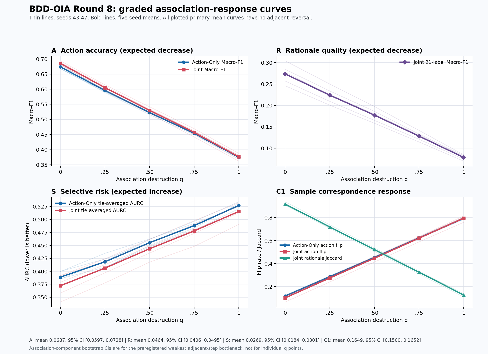
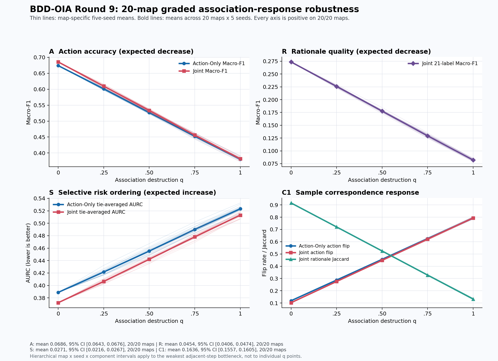

# BDD-OIA 上的 ARSC-Eval

本仓库用于检验四个互补评价维度——准确性（Accuracy）、解释理由
（Rationale）、安全选择性（Safety）和一致性（Consistency），简称
ARSC——能否揭示仅看动作准确率时容易遗漏的模型行为。

主实验在 BDD-OIA 官方划分上，对 Action-Only ResNet-50 与 Joint
Action-Rationale ResNet-50 进行五个随机种子的配对比较。仓库会完整保留
负向测量审计、失败实验和停止决策；例如，关键证据缺口（CEG）分支的所有
候选掩码版本均未通过冻结的视觉质量门，因此不会被包装成成功结果。

## 当前结论

ARSC 作为“诊断性指标分解”得到了较强的 BDD-OIA 内部证据：

- 联合模型的动作质量和基于排序的选择性风险平均有所改善；
- 固定覆盖率风险与校准结果仍不确定；
- 理由预测显著高于零，但类别间差异很大；
- 扰动一致性平均改善，但不同随机种子之间存在异质性；
- 冻结缓存上的极端破坏、分级破坏和 20 个预冻结映射均能产生预期方向的
  四轴响应；
- 对原图实际重推理的多严重度合成亮度、模糊和噪声扰动中，12 个严格门控仅有
  3 个通过，且全部属于 C1；A、R、S 没有获得普遍单调响应支持。
- 在结果盲冻结的 Round 12 配对分析中，Joint 相对 Action-Only 的跨剂量动作
  翻转优势为 `D_C1=0.020017`，Bonferroni 单侧下界为 `0.001826`；三个扰动族
  均为正、五个种子中四个为正。A、R、S 同时通过预设的 `-0.01` 非劣护栏。

这些结果不等于“理由监督改善所有 ARSC 维度”，也不证明理由忠实性、因果
证据使用、真实道路安全性或跨数据集外部有效性。更准确的结论是：四个维度
测量的是可分离的模型行为；其中 C1 能揭示动作或理由集合发生大幅改变、但
总体正确率和选择性风险几乎不变的情况。

## 主实验结果

随机种子 43–47 是新的主重复实验；种子 42 仅作为存档先导实验，不进入主
均值。下表区间来自 2,000 次分层配对 bootstrap：先重采样训练种子，再在
所选种子内重采样图像。

| 维度 / 指标 | Action-Only | Joint | 差值方向与数值 | 分层 95% 区间 |
|---|---:|---:|---:|---:|
| A：动作 Macro-F1 | 0.674050 | 0.685586 | Joint−Action = +0.011536 | [0.001590, 0.021807] |
| R：理由 Macro-F1 | 不适用 | 0.273589 | 不适用 | [0.256071, 0.292872] |
| R：理由 Micro-F1 | 不适用 | 0.503062 | 不适用 | [0.483546, 0.522462] |
| S：AURC（越低越好） | 0.388824 | 0.372227 | Joint−Action = −0.016597 | [−0.033558, −0.000400] |
| S：90% 覆盖率下的不安全接受率（越低越好） | 0.490931 | 0.479863 | Joint−Action = −0.011068 | [−0.026036, 0.002000] |
| S：校准后 ECE（越低越好） | 0.324007 | 0.324461 | Joint−Action = +0.000454 | [−0.020440, 0.016291] |
| C1：平均动作翻转率（越低越好） | 0.118543 | 0.102436 | Action−Joint = +0.016107 | [0.001009, 0.032814] |
| C1：Joint 理由 Jaccard | 不适用 | 0.916003 | 不适用 | [0.908090, 0.926552] |

冻结决策如下：

- 动作可比性通过：Macro-F1 差值的完整区间落在预注册的
  `[-0.03, +0.03]` 等效边界内。
- RQ2-light 扰动子分支通过：平均
  `Flip(Action)−Flip(Joint)=0.016107`，五个种子中四个为正；亮度、模糊
  和噪声上的平均优势分别为 `0.013562`、`0.009173`、`0.025587`，均高于
  预注册下限 `−0.01`。
- RQ2 CEG 子分支仍未回答，因为 v4 掩码测量门失败。C1 鲁棒性不能被解释
  为因果证据使用。

## 实验设计

- 数据集：BDD-OIA 官方训练/验证/测试划分；测试集含 4,557 个有效四动作
  样本。
- 动作标签：Forward、Stop、Left、Right。
- 理由标签：BDD-OIA 官方 21 类理由本体。
- 模型：ImageNet 预训练 ResNet-50；分别使用四动作单头，或共享骨干的动作
  与理由双头。
- 配对：同一种子内使用相同的骨干/动作头初始化和数据顺序。
- 训练：固定五个 epoch，仅依据验证集动作 Macro-F1 选择检查点。
- 阈值：动作与理由预测均固定为 `0.5`。
- 安全性：两个模型分别在验证集拟合一个标量温度；测试集从不用于选择温度、
  阈值、epoch 或种子。
- C1：内存中无损生成亮度 `1.10`、高斯模糊半径 `1.0` 和确定性高斯噪声
  `5/255`。
- C1 测量门：在不查看模型输出的前提下人工审阅 100 张图像 × 3 种扰动；
  所有条件均通过冻结的 `≥0.95` 语义不变性阈值。
- 不确定性：种子内使用配对图像 bootstrap，跨种子使用“种子→图像”的
  分层 bootstrap。

完整冻结协议、修订、种子原始值、区间和决策位于：

- `outputs/validity/rq1_multiseed_frozen_protocol.json`
- `outputs/validity/rq1_protocol_amendment01.json`
- `outputs/validity/rq1_multiseed_summary.json`

## 仓库结构

```text
configs/       先导实验、有效性实验和种子 43–47 的冻结配置
scripts/       下载、预处理、训练、评估、审计和汇总入口
src/           数据集、模型、ARSC 指标、bootstrap 与有效性工具
tests/         指标、扰动、掩码、协议和可行性的确定性测试
outputs/       主结果、负向审计、审阅备忘录、日志和工件索引
checkpoints/   本地可恢复检查点（Git 忽略）
data/          下载和处理后的数据（Git 忽略）
```

`outputs/README.md` 提供更细的结果索引，并区分主结果、存档结果、失败测量和
外部可行性工件。

## 环境

建议使用 Python 3.11 和支持 CUDA 的 PyTorch。先安装与本机 GPU 匹配的
PyTorch/torchvision，再安装运行与测试依赖：

```powershell
python -m pip install -r requirements.txt
python -m pip install -r requirements-dev.txt
```

已完成实验使用 RTX 5090、Python 3.11.13、CUDA 13.0（由 PyTorch 报告）、
torch `2.10.0.dev20251012+cu130`、torchvision
`0.25.0.dev20251012+cu130`、OpenCV `4.11.0` 和 Ultralytics `8.4.45`。
机器可读环境快照位于 `outputs/environment_snapshot.json`。

## 从头复现

### 1. 下载并准备官方最后一帧数据

```powershell
python scripts/download_data.py --data-root data
python scripts/prepare_data.py --config configs/experiment.yaml
python scripts/download_pretrained.py --artifact resnet50
```

### 2. 运行预检与低成本指标有效性分析

```powershell
python scripts/smoke_test.py --config configs/experiment.yaml --device cuda
python scripts/analyze_metric_validity.py --config configs/experiment.yaml --device cuda
python scripts/build_perturbation_semantic_audit.py --config configs/experiment.yaml
python scripts/summarize_perturbation_semantic_audit.py
```

### 3. 运行五个配对种子

```powershell
powershell -ExecutionPolicy Bypass -File scripts/run_rq1_multiseed.ps1 -PythonExe python
```

若希望在 Windows/WSL 上无人值守运行，可在 WSL 中指定 Windows Python，
再启动 tmux：

```bash
ARSC_PYTHON_EXE='D:\path\to\python.exe' bash scripts/launch_rq1_multiseed_tmux.sh
tmux attach -t arsc_rq1_multiseed
```

仓库中的成功正式运行使用了经独立批准、仅修复序列化问题的历史重启脚本
`scripts/run_rq1_multiseed_amendment01.ps1`。新的复现实验应使用
`run_rq1_multiseed.ps1`。

### 4. 复现存档种子 42 先导实验

以下命令重建保存在 `outputs/` 根目录下的原始先导工件，它们不属于五种子主
分析：

```powershell
python scripts/train_model.py --config configs/experiment.yaml --model action_only --device cuda
python scripts/train_model.py --config configs/experiment.yaml --model joint --device cuda
python scripts/calibrate.py --config configs/experiment.yaml --device cuda
python scripts/generate_masks.py --config configs/experiment.yaml --device 0
python scripts/generate_perturbations.py --config configs/experiment.yaml
python scripts/evaluate.py --config configs/experiment.yaml --device cuda
```

## 验证仓库

```powershell
$env:PYTHONPATH='src'
python -m pytest -q
python -m compileall -q scripts src tests
python scripts/verify_outputs.py --config configs/experiment.yaml
```

当前完整测试套件为 `325 passed, 3 skipped`。Round 10 attempt02 的正式运行还通过了
精确文件集合、内部哈希、数据清单、语义网格和一次性运行边界检查。

## 测量与外部数据停止结果

- 掩码 v2 未通过关键绑定门。
- 掩码 v3 未通过绑定门和控制污染门。
- 掩码 v4 使用文件名互斥的红/绿灯总体，但未通过冻结的总体/状态门，且有
  两个渲染补丁尺寸不匹配，因此未计算确认性 CEG。
- BDD100K 官方验证标签仅产生 53 个未见过且状态匹配的候选，低于 v5
  预注册总体门。
- 一次性的 BDD100K-train v5 元数据交集在哈希前最多只有 87 个状态匹配
  候选（红灯 50、绿灯 37）。该冻结运行还使用了错误图像根目录，无法建立
  哈希独立性。由于 87 已低于冻结的总量 `≥200` 与绿灯 `≥70` 门，独立
  审阅正式关闭 CEG 主线，不再重跑或创建 v6。
- VLA4CoDrive 技术上可读取，但冻结仓库版本仅公开 9 个标准场景，最多形成
  2,160 个 Action/Language 配对窗口。独立审阅要求停止外部训练。

这些负向结果很重要：它们防止弱证据定位或伪重复外部数据被错误地包装成
指标有效性证据。

## Round 7：冻结缓存上的指标证伪实验

Round 7 仅复用冻结的种子 43–47 缓存。83 个精确不变量全部通过，并精确
复现 Round 5 的 A/R/S/C1 数值。10 个方向性控制均在 5/5 种子上为正，且
交叉 bootstrap 的逐点 95% 区间均高于零：

- A 原始−破坏 Macro-F1：Action-Only `0.312962`，Joint `0.320033`；
- R 原始−破坏 Macro-F1：`0.230389`；
- S 随机排序−原始 AURC：`0.137671` 与 `0.146539`，另设的
  oracle/adversarial 排序门也通过；
- C1 错配−正确动作翻转：`0.669739` 与 `0.688713`；
  正确−错配理由 Jaccard：`0.782538`。

一个只读取原始量、独立实现的重建程序复现了全部原始值与 2,000 次
bootstrap 区间，最大绝对误差为 0。形式协议通过，但科学结论仍为
**PARTIAL**：这属于 BDD-OIA 内部极端控制证据，不是一般构念、因果、严重度、
安全或外部有效性证据。六个理由类别在原始与破坏条件下 F1 均为 0，正式区间
也没有按视频片段聚类。完整哈希链位于
`outputs/validity/arsc_axis_falsification_artifact_index.json`。

## Round 8：分级关联—响应实验

Round 8 将极端控制扩展为一个在查看结果前冻结的嵌套关联映射，
`q={0,0.25,0.50,0.75,1.00}`。它仅复用种子 43–47 的冻结预测缓存，不进行
训练、推理、阈值选择、掩码生成或数据下载。目标片段和来源片段共同引入的
依赖由 1,625 个映射闭合关联分量处理。

| 轴 | 五种子平均最弱步长 | 关联分量 95% 区间 | 正向种子 |
|---|---:|---:|---:|
| A：动作 Macro-F1 下降 | 0.068671 | [0.059674, 0.072806] | 5/5 |
| R：理由 Macro-F1 下降 | 0.046416 | [0.040571, 0.049523] | 5/5 |
| S：并列平均 AURC 上升 | 0.026936 | [0.018370, 0.030091] | 5/5 |
| C1：对应关系退化 | 0.164889 | [0.150002, 0.165152] | 5/5 |

四个预注册门全部通过，所有五种子均值曲线均无相邻反转。独立实现不导入正式
指标代码，从分量级混淆计数重建 A/R、从精确并列置信度公式重建 S、从逐图
事件重建 C1，并以最大绝对误差 `1.88e-14` 和 `2.42e-15` 复现全部点估计
和 bootstrap 汇总（7/7 审计通过）。



尽管计算与形式裁决为 **PASS / VALID**，独立科学裁决仍为
**PARTIAL / BOUNDED INTERNAL EVIDENCE**。它支持指标对冻结关联破坏具有分级
响应，但不建立本体完备性、理由忠实性、因果鲁棒性、校准有效性、真实驾驶
安全或外部有效性。完整证据链位于
`outputs/validity/round8_graded_response_artifact_index.json`。

## Round 9：20 个映射的鲁棒性实验

Round 9 检验 Round 8 的结果是否依赖某个有利映射/盐值。实验在读取任何新
`q>0` 结果前冻结 20 个新的合法映射，将历史 Round 8 映射排除在主门之外，
并使用“映射 × 种子 × 映射内关联分量”的分层 bootstrap。一次性正式运行
以 `attempt01` 完成。

| 轴 | 20 映射总平均瓶颈 | 分层逐点 95% 区间 | 正向映射 |
|---|---:|---:|---:|
| A | 0.068648 | [0.064261, 0.067624] | 20/20 |
| R | 0.045433 | [0.040589, 0.047385] | 20/20 |
| S | 0.027080 | [0.021644, 0.026686] | 20/20 |
| C1 | 0.163594 | [0.155702, 0.160482] | 20/20 |

四个预注册门全部通过。独立实现既不导入 Round 9 正式分析，也不导入
`arsc_eval`，重新计算全部点诊断和 2,000 次分层抽样，8/8 检查通过。最大
点差为 `2.23e-14`；每个 bootstrap 选择和四轴数值均精确一致，正式与独立
抽样文件逐字节相同。



独立科学裁决为 **BOUNDED CONDITIONAL PASS**。该结果关闭了“结论依赖单个
映射/盐值”的疑问，但 20 个映射不等于 20 个数据集，也不建立外部有效性、
同时族 95% 覆盖、理由忠实性、校准有效性、因果证据或真实道路安全性。六个
有正目标支持的理由类在每个映射、种子和 q 上均没有预测正例且 F1 为 0，
因此 R 的聚合响应由其余 15 类驱动。

完整证据链位于
`outputs/validity/round9_multimap_artifact_index.json`，最终独立审阅位于
`outputs/research_review_memo_round9_postresult.md`。BDD-OIA 映射/盐值实验
线已永久关闭。

## Round 10：合成像素扰动剂量—响应实验（已完成）

Round 10 在 BDD-OIA 测试集上对原图施加合成扰动并实际重新推理，检验亮度、
高斯模糊和确定性高斯噪声的多严重度剂量—响应。实验覆盖种子 43–47、
4,557 张图像和 3,904 个源视频片段；每个扰动族包含干净基线与四个非零
级别。方向性估计量、实际效应阈值、12 重 Bonferroni 门控、5,000 次共享
“种子—源片段”bootstrap 以及一次性停止规则均在查看结果前冻结。

100 张图像 × 3 个扰动族 × 4 个非零级别的语义审计共包含 1,200 对图像，
12/12 个语义分层全部通过。第一次正式尝试在任何模型载入前因 WSL 到 Windows
的环境变量未透传而停止；该尝试没有生成任何模型结果，事故日志与哈希被永久
保留。独立审阅仅授权修复启动基础设施，随后 attempt02 经再次盲审获得
`GO_ROUND10_FORMAL_RUN_ATTEMPT02`，一次完成 65 个条件和全部 5,000 次抽样。

冻结的最终判定为 **`ROUND10_PARTIAL_OR_FAIL`**：12 个“扰动族 × 指标轴”
门控中通过 3 个，全部是 C1。

| 扰动族 | A：动作 | R：理由 | S：选择性风险 | C1：样本对应一致性 |
|---|---:|---:|---:|---:|
| 亮度 | 未通过 | 未通过 | 未通过 | **通过** |
| 高斯模糊 | 未通过 | 未通过 | 未通过 | **通过** |
| 确定性高斯噪声 | 未通过 | 未通过 | 未通过 | **通过** |

C1 的结果跨三个算子均为 5/5 种子正向、均值曲线无相邻反转、经过多重比较
校正的单侧下界大于零，且实际效应门全部通过：

| 扰动族 | Action-Only 动作翻转率 | Joint 动作翻转率 | Joint 理由 Jaccard 下降 |
|---|---:|---:|---:|
| 亮度 | 0.193241 | 0.170770 | 0.145944 |
| 高斯模糊 | 0.265043 | 0.232390 | 0.224183 |
| 确定性高斯噪声 | 0.196884 | 0.160325 | 0.142494 |

A 在部分“干净→最高严重度”端点上下降，但局部反转使严格单调门失败；R 的
端点下降仅约 0.0044–0.0059，低于预注册的 0.01 实际效应门；S 在亮度与
模糊下变化很小，在噪声下甚至向相反方向变化。因而本轮不是“四轴全部有效”
的证据，而是更有区分力的结果：C1 能稳定发现预测集合的大幅变化，而总体
Macro-F1、理由 Macro-F1 或 AURC 可能几乎不变。它支持 C1 的诊断敏感性和
ARSC 四轴的可分离性，不支持把 C1 解释为因果忠实性、校准保证或真实安全。

独立结果后审阅从 logits 和 primitives 重建了 3,975 行诊断，并逐位重放
全部 5,000 组随机抽样；制品哈希、诊断、抽样、84 个分位数和 36 行
bootstrap 汇总均为 0 mismatch。审阅结论为
**`ACCEPT_ROUND10_PARTIAL_OR_FAIL_AS_VALID_FINAL_OUTCOME`**，同时禁止通过
改阈值、挑种子或调整严重度对 3/12 结果作结果追随式“修复”。

关键证据：

- [正式结果 JSON](outputs/validity/round10_corruption_formal_attempt02/round10_corruption_results.json)
- [bootstrap 汇总](outputs/validity/round10_corruption_formal_attempt02/round10_corruption_bootstrap_summary.csv)
- [逐点诊断](outputs/validity/round10_corruption_formal_attempt02/round10_corruption_point_diagnostics.csv)
- [正式制品哈希索引](outputs/validity/round10_corruption_artifact_index_attempt02.json)
- [完整 tmux 运行日志](outputs/validity/round10_corruption_formal_attempt02.log)
- [attempt01 基础设施事故记录](outputs/validity/round10_formal_attempt01_incident.json)
- [独立结果后 SCI 审阅](outputs/research_review_memo_round10_postresult.md)
- [机器可读审阅判定](outputs/validity/round10_postresult_reviewer_decision.json)

## Round 11：DAAD-X 外部验证准备（传输阶段已完成）

DAAD-X 官方归档的 70 个固定 range 已全部下载并逐段校验，随后在 tmux 中以
opaque bytes 方式组装；整个传输阶段没有打开 gzip/tar、读取标签或解码视频。
组装归档为 `18,585,647,156` 字节，独立复算 SHA-256 为
`98E6DD4D068004B090A5D62C648A727AF902EBF3B176BCE2CE044EABDE91E965`。
70 段逐段 SHA、顺序拼接 SHA、组装归档 SHA 和 assembler manifest 四方一致。

一次性严格 transport receipt 已生成并通过结果后独立复核，receipt SHA-256 为
`D738E21E5DC1976C192CFA3982E2CA2941FF3D2AF8A811BA432D51778A6B1C7F`。
仓库只保存 1,629 字节的收据快照、协议、代码和审阅证据；18.6 GB 原始归档与
分块继续由 Git 忽略。Phase 1 补充协议和一次性 claim/原子发布原语也已冻结，
但尚未创建真实 claim、尚未打开归档内容，也没有运行 G0–G3。因此 Round 11
目前不是外部有效性结果，更不是 `GO_RUN` 或训练授权。

在传输闭合之后，又单独冻结了一个结果盲的“归档布局清单”门控。当前已完成
但尚未运行的部分包括：自定义单成员 gzip/raw-deflate 状态机、原始 512 字节
POSIX USTAR/PAX 解析、普通成员载荷的有界读后即丢、路径碰撞检查、有界 public
CSV 与 restricted JSONL 流式 sink、进程 watchdog，以及数据无关的一次性 claim、
权威文件精确绑定、STOP/COMPLETE 语义校验、流式哈希索引和无覆盖原子发布控制层。
控制层还能原样闭合硬终止产生的尾部半行，不会把 partial 提升为 complete；对
COMPLETE 则重新聚合成员类型、大小、资源上限、重复路径和 Unicode casefold
碰撞状态。全部测试只使用现场构造的合成文件，没有使用 `tarfile`/`gzip` 作为
解析权威，也没有触碰真实 DAAD-X 归档。

解析器裁决为 `GO_IMPLEMENTATION_NOT_RUN`，运行器设计裁决为
`GO_DESIGN_RUNNER_INTEGRATION_NOT_RUN`，控制层在多轮独立 `STOP_FIX` 后裁决为
`GO_CONTROL_IMPLEMENTATION_NOT_RUN`。Windows Job Object worker/supervisor 第一闭环
也已实现并获得 `GO_RUNNER_SUPERVISOR_IMPLEMENTATION_NOT_RUN`：worker 以 suspended
状态创建，在启用单进程上限与关闭即杀 Job、分配成功后才恢复；无关可继承句柄
不会泄漏，archive opener 只能在固定 READY 后调用，供给、控制与日志共享硬截止
时间。当前全量回归为 `559 passed, 10 skipped`。

这些裁决都不等于 `GO_RUN`。下一步仍需把 receipt/manifest 权威复制、十二项 STOP/
COMPLETE 生成和已审阅 control 串成完整正式父进程，再独立审阅；之后才能生成
HEAD-exact execution binding 并取得单独运行授权。只有再通过该门控，才允许创建
永久 layout claim 并首次读取真实归档结构。

关键证据：

- [严格 transport receipt](outputs/validity/round11_daadx_transport_receipt.json)
- [组装字节独立复核](outputs/validity/round11_assembled_transport_reviewer_decision.json)
- [receipt 结果后独立复核](outputs/validity/round11_transport_receipt_postgeneration_reviewer_decision.json)
- [Phase 1 additive 补充协议](outputs/validity/round11_daadx_phase1_diagnostic_amendment.json)
- [Phase 1 控制面独立复核](outputs/validity/round11_phase1_control_reviewer_decision.json)
- [布局清单冻结协议](outputs/validity/round11_daadx_layout_inventory_protocol.json)
- [布局清单实现独立审阅](outputs/research_review_memo_round11_layout_inventory_implementation.md)
- [布局清单实现机器可读裁决](outputs/validity/round11_layout_inventory_implementation_reviewer_decision.json)
- [布局运行器设计独立审阅](outputs/research_review_memo_round11_layout_runner_design.md)
- [布局运行器设计机器可读裁决](outputs/validity/round11_layout_runner_design_reviewer_decision.json)
- [布局控制层实现独立审阅](outputs/research_review_memo_round11_layout_control_implementation.md)
- [布局控制层机器可读裁决](outputs/validity/round11_layout_control_implementation_reviewer_decision.json)
- [布局 worker/supervisor 实现独立审阅](outputs/research_review_memo_round11_layout_runner_implementation.md)
- [布局 worker/supervisor 机器可读裁决](outputs/validity/round11_layout_runner_implementation_reviewer_decision.json)

## Round 12：配对多轴监督—剂量交互复分析（已完成）

Round 12 不训练模型也不重新推理，而是结果盲地复用 Round 10 已冻结的逐图像
primitives 和同一组 5,000 次“种子—源片段”抽样，检验 Joint rationale
supervision 是否在全部 12 个非零“扰动族 × 剂量”格上具有稳定的动作一致性
优势，同时守住 A、R、S 三轴的非劣边界。分析方向、四个效应量、`0.01`
实际效应门、Bonferroni `q=0.0125` 单侧下界、seed/family 护栏和一次性停止规则
均在读取结果前冻结，并经独立审阅授权唯一一次 `attempt01`。

正式结构化判定为 **`PASS`**，独立结果后裁决为
**`ACCEPT_PASS_WITH_LIMITATIONS`**：

| 效应 | 点估计 | q=0.0125 单侧下界 | 冻结解释 |
|---|---:|---:|---|
| D_A | +0.003826 | +0.000220 | Joint 动作质量相对保持，通过 `-0.01` 非劣门 |
| D_R | −0.001956 | −0.003641 | Joint 理由质量的组内保持，通过 `-0.01` 非劣门 |
| D_S | +0.000796 | −0.005292 | Joint 选择性风险相对保持，通过 `-0.01` 非劣门 |
| D_C1 | **+0.020017** | **+0.001826** | Joint 平均少约 2.00 个百分点动作翻转 |

D_C1 的 brightness、blur、noise family 汇总分别为 `0.016820`、`0.016765`、
`0.026465`。五个 seed 中四个为正，但 seed 43 为 `-0.001884`，因此结果存在
明确的训练随机性异质性。A/R/S 的角色是预注册非劣护栏，不能改写为三轴均
显著改善；R 还是 Joint 模型内部保持量，并非两个模型之间的理由质量比较。

本轮加强了 BDD-OIA 内部、跨四个非零剂量汇总的 RQ2-light 动作一致性证据，
但 RQ2-CEG 仍未回答，也不建立因果证据使用、理由忠实性、真实道路安全或
跨数据集外部有效性。持久 attempt claim 必须保留，正式分析不得重跑。

关键证据：

- [正式结果 JSON](outputs/validity/round12_existing_outputs_results.json)
- [逐点与门控诊断](outputs/validity/round12_existing_outputs_point_diagnostics.csv)
- [四效应 bootstrap 抽样](outputs/validity/round12_existing_outputs_component_draws.npz)
- [正式制品哈希索引](outputs/validity/round12_existing_outputs_artifact_index.json)
- [独立结果后审阅](outputs/research_review_memo_round12_existing_outputs_postresult.md)
- [机器可读结果后判定](outputs/validity/round12_existing_outputs_postresult_reviewer_decision.json)

## 结果解释边界

目前证据仅支持：在冻结的 BDD-OIA 测试总体、现有五个训练种子、固定阈值与
校准方式以及明确的合成算子下，ARSC 指标能够区分和追踪若干预注册行为变化。

目前证据不支持：

- 跨数据集、跨域、跨架构或跨训练协议的一般有效性；
- 理由是否真实地反映模型因果决策过程；
- 真实道路扰动、自然严重度尺度或安全保证；
- 理由本体完备性或所有 21 类理由均有效；
- 将 C1 样本对应一致性解释为视觉忠实性；
- 将单审阅者 100 图像语义审计解释为总体层面的 95% 保证。

## 发布策略

原始数据集、检查点、检测器权重以及含数据集像素的视觉审计接触表不进入 Git。
数值结果、无损预测缓存、清单、人工决策、哈希、配置、代码、审阅备忘录和
完整日志进入版本控制。接触表保留在本机，可由已跟踪的清单和脚本重新生成。
