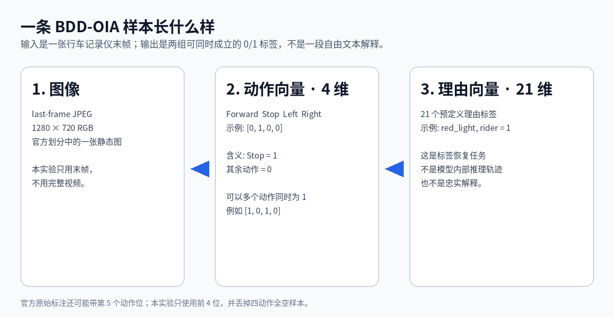
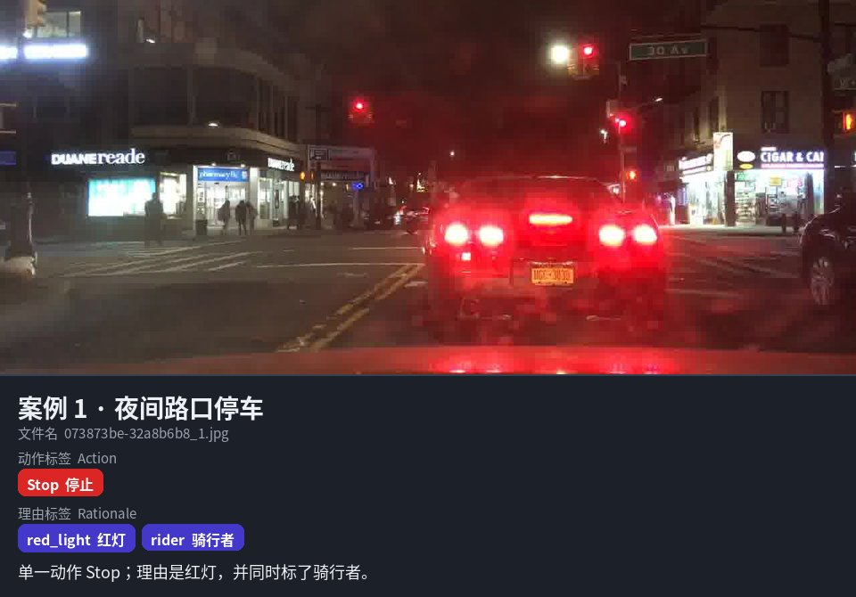
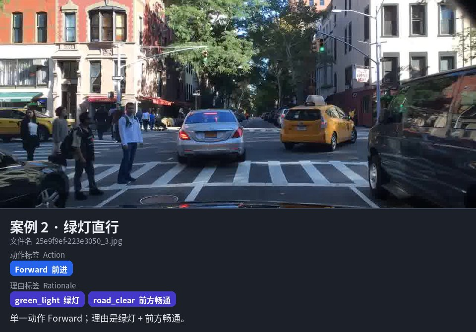
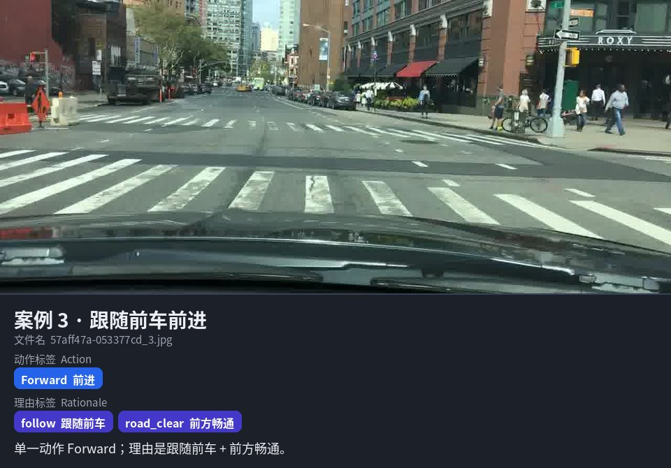
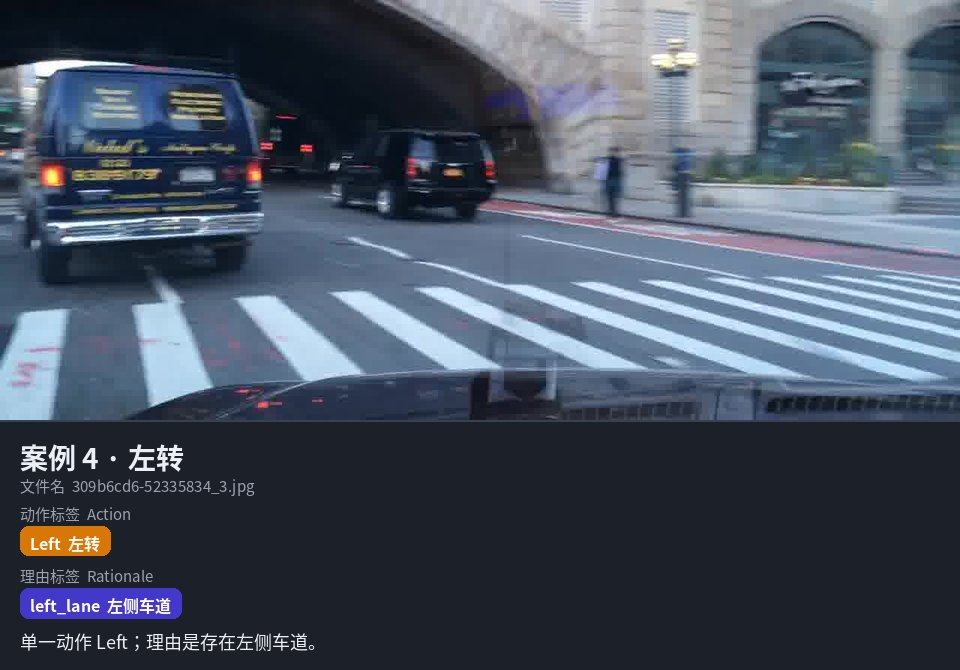
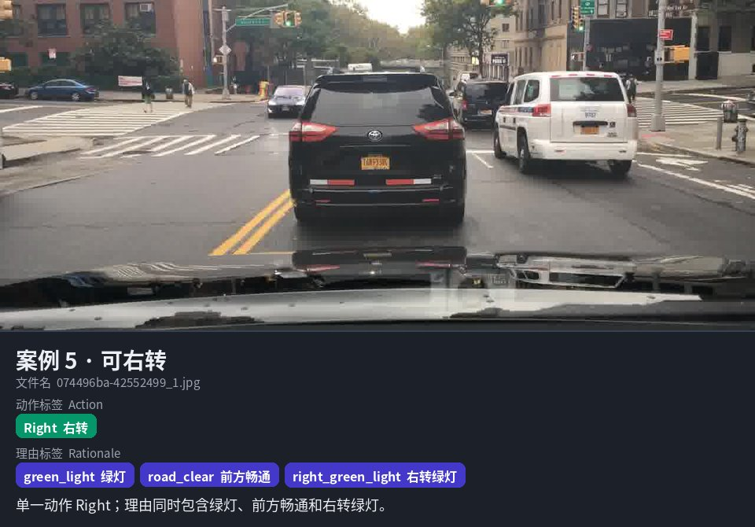
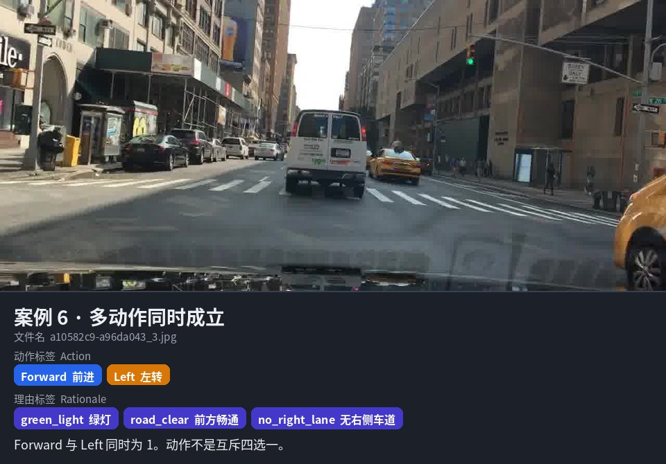

# BDD-OIA 数据集长什么样

本页只介绍 **ARSC 实验实际用到的数据集形态**：一张行车记录仪末帧，加上两组可以同时成立的 0/1 标签。  
看完应能明白：输入是什么、标签长什么样、为什么本实验用它，以及它**不是**什么。

完整实验数字、评价协议和论文边界见仓库根目录 [`README.md`](../../README.md) 与 [`docs/paper/ARSC_PAPER_HANDOFF.md`](../paper/ARSC_PAPER_HANDOFF.md)。  
本页案例图是官方 last-frame 测试集中的少量缩小摘录，不是完整数据镜像。

---

## 它是什么，本实验拿它干什么

**BDD-OIA**（Berkeley DeepDrive Object-Induced Actions）是公开驾驶数据集 [BDD100K](https://www.bdd100k.com/) 的扩展：从较复杂的城市场景里取出视频片段，给**最后一帧**标上

- 4 个驾驶动作：`Forward` / `Stop` / `Left` / `Right`
- 21 个预定义理由标签，例如 `red_light`、`green_light`、`follow`、`road_clear`

原始工作：Yiran Xu 等，*Explainable Object-Induced Action Decision for Autonomous Vehicles*，CVPR 2020。  
项目页：<https://twizwei.github.io/bddoia_project/>

在本仓库里，BDD-OIA 只是 **proxy benchmark / 代理试场**。它用来检验：多维评价协议能不能算出来、会不会改变“只看动作准确率”的判断。  
它**不是**核电数据，也**没有**验证核电安全。

---

## 一条样本长什么样



仓库里处理后的一条记录就是这样：

```json
{
  "file_name": "073873be-32a8b6b8_1.jpg",
  "actions": [0, 1, 0, 0],
  "rationales": [0, 0, 0, 1, 0, 0, 0, 1, 0, 0, 0, 0, 0, 0, 0, 0, 0, 0, 0, 0, 0]
}
```

读法：

| 字段 | 含义 | 这个例子 |
|---|---|---|
| `file_name` | 官方 last-frame JPEG 文件名 | 夜间路口那一张 |
| `actions` | 4 位 multi-hot，顺序固定为 Forward / Stop / Left / Right | 只有 Stop |
| `rationales` | 21 位 multi-hot，顺序见下表 | `red_light` 和 `rider` |

两件最容易误会的事：

1. **动作不是四选一。** `Forward` 和 `Left` 可以同时为 1。
2. **理由不是一段解释文字。** 它是预先列好的 21 个开关。本实验把它当作标签恢复任务，不把它写成“模型真的在这样推理”。

---

## 六个真实案例

下面 6 张都来自官方 **test** 划分。图下色块是该样本的**真实标注**，不是模型预测。

### 1. 夜间红灯停车



最直观的一类：车停着，红灯在，理由里还有 `rider`（骑行者）。一张图可以带多个理由。

### 2. 绿灯直行



动作只有 `Forward`；理由是 `green_light` + `road_clear`。  
注意：图里仍可能有前车、行人、斑马线，但官方标签只打开了这两个开关。标签是离散标签，不是完整场景描述。

### 3. 跟随前车前进



同样是前进，但理由换成了 `follow`（跟随前车）。  
同一动作可以对应不同理由组合。

### 4. 左转



`Left` 单独为 1，理由是 `left_lane`。  
左转/右转各有一套左右侧标签，并不共用“有车道”这一个词。

### 5. 可右转



动作只有 `Right`，但理由可以叠好几层：普通绿灯、前方畅通、右转绿灯。

### 6. 多个动作同时成立



这是理解本数据集最关键的一张：`Forward` 和 `Left` **同时为 1**。  
官方设定里，复杂场景常常允许不止一种合法动作。所以本实验把动作做成 4 个独立二分类，而不是 4 类互斥分类。

---

## 21 个理由标签

官方按四个动作方向分组。名称以仓库 `src/arsc_eval/constants.py` 为准。

| 关联动作 | 英文标签 | 中文 |
|---|---|---|
| Forward | `green_light` | 绿灯 |
| Forward | `follow` | 跟随前车 |
| Forward | `road_clear` | 前方畅通 |
| Stop | `red_light` | 红灯 |
| Stop | `traffic_sign` | 交通标志 |
| Stop | `car` | 车辆 |
| Stop | `person` | 行人 |
| Stop | `rider` | 骑行者 |
| Stop | `other_obstacle` | 其他障碍 |
| Left | `left_lane` | 左侧车道 |
| Left | `left_green_light` | 左转绿灯 |
| Left | `left_follow` | 左转跟随 |
| Left | `no_left_lane` | 无左侧车道 |
| Left | `left_obstacle` | 左侧障碍 |
| Left | `left_solid_line` | 左侧实线 |
| Right | `right_lane` | 右侧车道 |
| Right | `right_green_light` | 右转绿灯 |
| Right | `right_follow` | 右转跟随 |
| Right | `no_right_lane` | 无右侧车道 |
| Right | `right_obstacle` | 右侧障碍 |
| Right | `right_solid_line` | 右侧实线 |

测试集上有 6 类长期几乎学不会（`car` / `person` / `left_lane` / `left_follow` / `no_left_lane` / `left_solid_line`）。这是标签覆盖问题，不是“模型没有解释能力”的证明。细节见论文交接文档。

---

## 规模：本实验实际用了多少

来源：冻结统计 `outputs/data_summary.json`。官方划分保留；丢掉四动作全空样本。

| 划分 | 官方样本 | 有效样本 | 丢掉原因 |
|---|---:|---:|---|
| train | 16,082 | 16,038 | 44 条四动作全空 |
| val | 2,270 | 2,258 | 12 条四动作全空 |
| test | 4,572 | **4,557** | 15 条四动作全空 |

其它本实验设定：

- 只用 last-frame 静态图，不用完整视频。
- 输入会缩到 `224 × 224`。
- 官方原始动作向量有时带第 5 位；本实验**只用前 4 位**。
- 理由全空但四动作有效的样本会保留。
- 测试集 4,557 张图来自 3,904 个 source clip；同一 clip 可能有 `_1.jpg` / `_3.jpg` 等多张末帧。

测试集动作正样本（可重叠，相加会超过 4,557）：

| Forward | Stop | Left | Right |
|---:|---:|---:|---:|
| 2,484 | 2,103 | 1,225 | 1,339 |

---

## 看标签时请记住

| 可以这样理解 | 不要这样理解 |
|---|---|
| 一张城市场景图 + 两套 multi-hot 标签 | 一段自然语言驾驶解释 |
| 公开代理任务，用来试评价协议 | 核电运行数据或核安全验证 |
| 理由标签 = 21 类开关有没有被标上 | 模型内部推理忠实 / explanation faithfulness |
| 动作可重叠 | 每个路口只有一个正确答案 |
| last-frame 静态图 | 完整时序视频理解 |

这 6 张案例图仅用于说明数据形式。完整图像需按官方 BDD-OIA last-frame 发布获取；本仓库不重分发整包数据。
